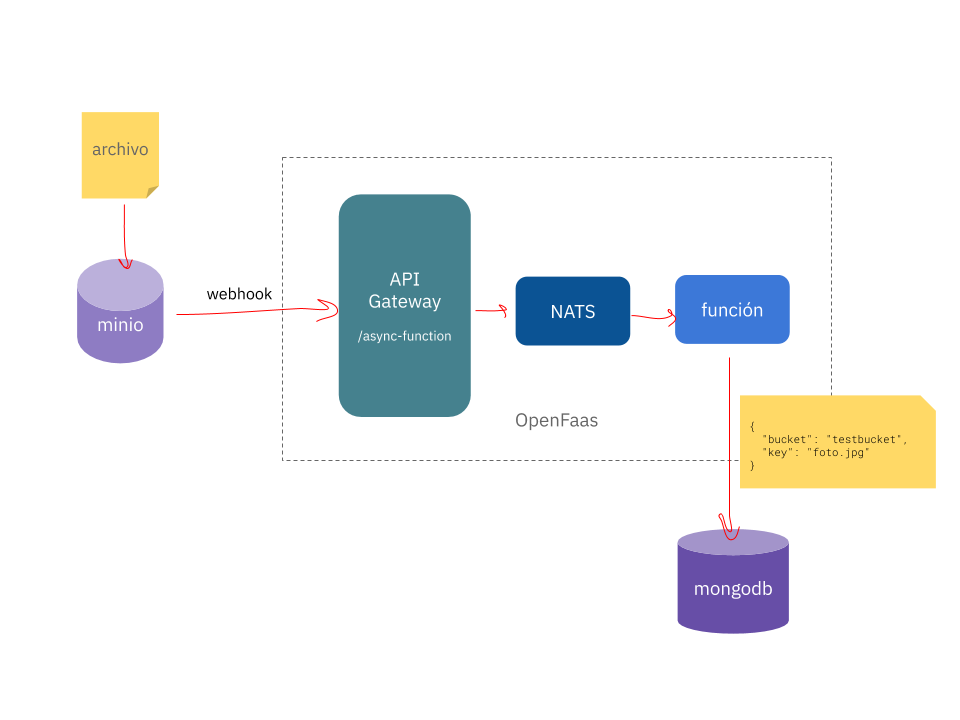

#  openfaas_minio_k8s



El objetivo es escribir y hacer deployment de una función en **openfaas** que reciba un objeto en formato JSON desde **minio** y lo guarde en una colección en **mongodb**.

##  Herramientas

###  Instalacion de openfaas

- Realizar la instalacion como fue descripta en el TP4, utilizando Kubernetes (https://docs.openfaas.com/deployment/kubernetes/)

- Utilizar minikube o en su defecto Okteto

###  Instalacion de min.io

- Realizar la instalacion sobre docker

- https://docs.min.io/docs/minio-docker-quickstart-guide.html

- Tener en cuenta las claves utilizadas para luego poder acceder

- Instalar en la máquina local el cliente minio para poder configurar el servidor

- https://docs.min.io/docs/minio-client-quickstart-guide.html

- Configurar en el archivo ```~/.mc/config.json``` el alias ```local``` con el access key y secret key correctos.

###  Instalacion de mongodb

- Realizar la instalacion tambien sobre docker

- https://phoenixnap.com/kb/docker-mongodb

##  Escribir la funcion

La funcion necesaria debe recibir el evento enviado por minio. El evento tiene la estructura indicada en la documentacion (https://docs.aws.amazon.com/AmazonS3/latest/dev/notification-content-structure.html).

Utilizar el driver de MongoDB correspondiente al lenguaje de programación elegido, para hacer una conexión a la base de datos.

Del objeto recibido, obtener *solamente* el **nombre del bucket** y **key del objeto**, y guardarlo en una colección.

Ejemplo

```json

{

"bucket": "testbucket",

"key": "foto.jpg"

}

```

##  Configuracion de Notificaciones

- Activar las notificaciones de tipo webhook

- https://docs.min.io/docs/minio-bucket-notification-guide.html#webhooks

- Apuntar el webhook a la URL asincronica de la función (/async-function)

- Tener en cuenta el acceso al host desde docker

- https://stackoverflow.com/a/24326540